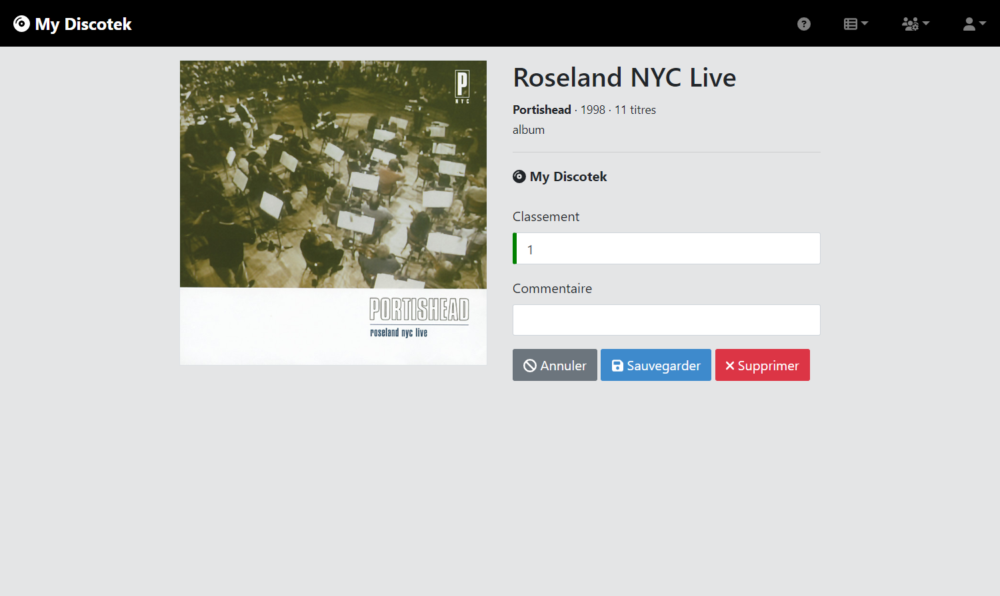

# MyDiscotek

L'application **MyDiscotek** permet de gérer des favoris album en s'appuyant sur la Spotify API.

| Page d'accueil | Ajout Favori |
| --- | --- |
|  |  |

> La version "production" de cette documentation est disponible via l'URL : http://todo/doc/000-intro.html

## MyDiscotek

- [Présentation](src/site/markdown/000-intro.md)
- [Accès à l’application](src/site/markdown/010-access.md)
- [Application](src/site/markdown/020-entities.md)
- [Questions Fréquentes](src/site/markdown/030-faq.md)
- [Administration](src/site/markdown/040-admin.md)
- [Modèle](src/site/markdown/070-model.md)
- [Terminologie](src/site/markdown/080-terminologie.md)
- [Intervenants](src/site/markdown/090-intervenants.md)

## Production

- [Installation](src/site/markdown/100-prod-install.md)
- [Administration](src/site/markdown/110-prod-admin.md)
- [Homologation](src/site/markdown/120-homologation.md)

## Gestion de Projet

- [Gestion de Projet](src/site/markdown/200-projet.md)
- [Changelog](src/site/markdown/210-CHANGELOG.md)
- [Tests](src/site/markdown/220-test.md)
- [Backlog](src/site/markdown/230-BACKLOG.md)
- [Gestion Documentaire](src/site/markdown/290-doc.md)

## Développement

- [Développement](src/site/markdown/300-dev.md)
- [jHipster](src/site/markdown/310-jhipster.md)
- [Git Flow](src/site/markdown/390-gitflow.md)
