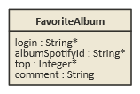

# Modèle

## Schéma

## Généralités

### cardinalite

| Cardinalité | Description |
| ----- | --- |
| 0..1  | Aucune ou une instance
| 1     | Une instance exactement - Information obligatoire
| 0..*  | Aucune ou plusieurs instances
| 1..*  | Une instance ou plusieurs (au moins une) - Information obligatoire
| &#42;..* | Aucune ou plusieurs instances / relation ManyToMany
| 1*..* | Aucune ou plusieurs instances / relation ManyToMany (au moins une) - Information obligatoire

- [Cardinalité](https://fr.wikipedia.org/wiki/Cardinalit%C3%A9_(programmation))

### type

| Type            | Description |
| --------------- | ----------- |
| texte(longueur) | Texte (String) en français. Peut contenir des accents. Encoding UTF-8. Longueur max précisée entre parenthèses. |
| entier          | Nombre entier (Integer). |
| long            | Nombre entier long (Long). |
| double          | Nombre décimal (Double). |
| date            | Date (LocalDate). |
| datetime        | Date et heure (ZonedDateTime). |
| booléen         | 0 ou 1 (Boolean). |
| enum            | Liste de valeurs prédéfinie et limitée. |

#### Enumérations vs Table de référence

Les énumérations (enum) ne sont pas modifiables via l'administration, contrairement aux tables de référence.  
Les valeurs de l'énumération sont utilisés en tant que constante dans le code. Pour modifier une énumération, une relivraison est nécessaire.

### propriétés

Les propriétés suivantes sont présentes dans toutes les tables. Pour des facilités de lecture, ces champs n'apparaissent sur les schémas modèle.

| Propriété   | Type      | Cardi nalité | Uni que | Description | Exemple |
| ----------- | --------- | ---------------- | ------------| ----------  | ------- |
| id          | long        | 1    | :white_check_mark: | Identifiant numérique (long) nommé "id" (convention JSON). Il n'a pas de sens fonctionnel et est en général issu d'une séquence SQL. | 1 |
| **Horadatage** |
| created_by         | texte(50) | 1       | | Login de l'utilisateur ayant créé l'objet. | admin |
| created_date       | datetime  | 1       | | Date de création de l'objet. | 2015-09-01T12:00:00+02:00 |
| last_modified_by   | texte(50) | 0..1 | | Login de l'utilisateur ayant effectué la dernière modification sur l'objet.| admin |
| last_modified_date | datetime  | 0..1    | | Date de dernière modification de l'objet.| 2015-09-01T12:00:00+02:00 |

Les propriétés suivantes sont rencontrées fréquemment.

| Propriété   | Type      | Cardi nalité | Uni que | Description | Exemple |
| ----------- | --------- | ---------------- | ------------| ----------  | ------- |
| code        | texte(10-50)   | 1    | :white_check_mark: | Code alpha numérique en général identifiant. | |
| nom         | texte(10-50)   | 1    | :white_check_mark: | Libellé alpha numérique en général identifiant. | |
| libelle     | texte(100)     | 1    | :white_check_mark: | Libellé (nom, titre, texte court) en général identifiant. | |
| description | texte(255-30000)| 0..1|                    | Description (texte long). | |

## Entities

### entity1

 ---

> [> Application](020-entities.md#entity1)

  ---

Entity1.

| Propriété   | Type      | Cardi nalité | Uni que | Description | Exemple |
| ----------- | --------- | ---------------- | ------------| ----------  | ------- |
| id          | long           | 1    | :white_check_mark: | Identifiant. | 1 |

### entity2

## Administration

### user

 ---

> [> Application](040-admin.md#user)

  ---

Utilisateur.

| Propriété   | Type      | Cardi nalité | Uni que | Description | Exemple |
| ----------- | --------- | ---------------- | ------------| ----------  | ------- |
| id          | long           | 1    | :white_check_mark: | Identifiant. | 1 |
| login       | texte(50)      | 1    |                    | Login. | pdupont |
| password_hash | texte(60)    | 1    |                    | Mot de passe crypté. | |
| first_name  | texte(50)      | 1    |                    | Prénom. | Pierre | |
| last_name   | texte(50)      | 1    |                    | Nom. | DUPONT |
| email       | texte(100)     | 1    |                    | Mail. | pierre.dupont@gmail.com |
| activated   | booléen        | 1    |                    | Indique si l'utilisateur est actif. | true |
| lang_key    | texte(5)       | 1    |                    | Langue préférée. | fr |
